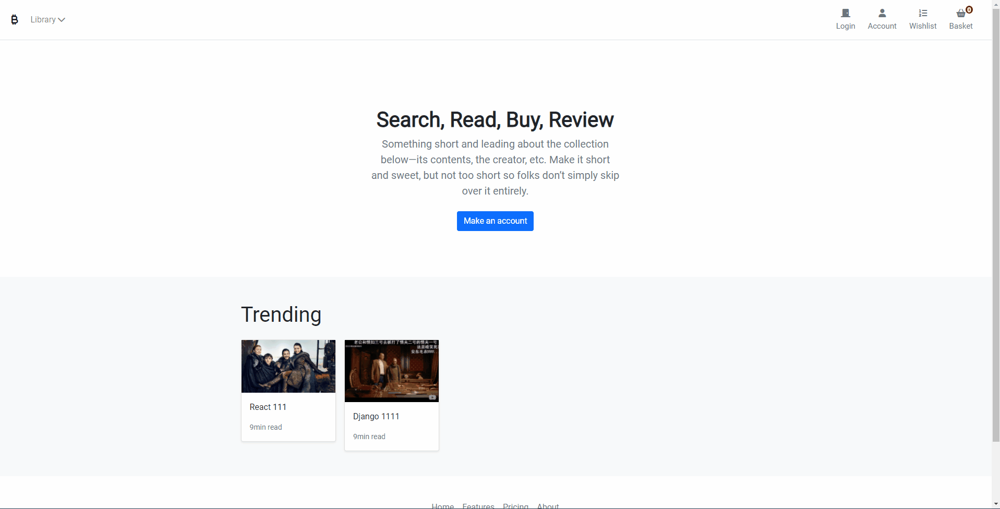

# Ecommerce project - Django

## Introduction

This is an E-commerce webiste that implements user registration, product browsing, purchase services and wishlist features. 

I am learning Django and Javscript through the whole process.

Framework: Django, Javscript, Bootstrap.

Display Image:

## Learning Path

- Day1: 
create model; how to test using coverage; find examples in bootstrap about css; use flake to satisfy pep8

- Day2: add session; create basket for summary; update front end UI; add user component; build signup

- Day3: Finished Signup with email confirmation; delete&update user; reset psw with email confirmation；payment with Stripe; order&payment connection; show orders in account

- Day4: rearrange some parts in templates; 

- Day5: Add wishlist feature using message framework. 

## Reflection

- Mixing python code and html code in templates are confusing and not that easy to maintain.
Detaching front-end and back-end will be trending like Django & React.

## By Gengcong Yan, 2022

- Great help from the tutorial channel - [Very Academy](https://www.youtube.com/channel/UC1mxuk7tuQT2D0qTMgKji3w)
 
